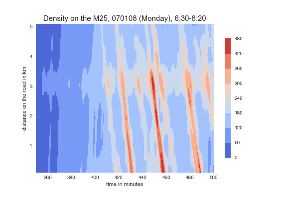
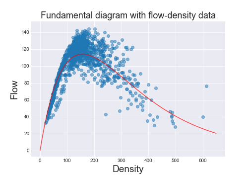
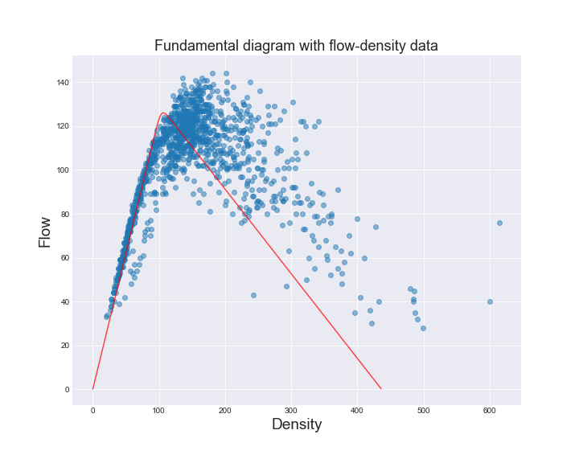

#Lighthill-Richards-Whitham model (LWR)

### Traffic Data

This is a plot of density of vehicles on the M25 for around 2 hours on a distance of 5km. Low density (ie: few vehicles) is in blue and high density in red.

Vehicles go forward in space and time which corresponds to upwards and to the right on the figure. Notice that there are high density waves (in red) that propagate against the flow of traffic (so these waves propagate with a negative speed).

Also note how there are low density waves (in dark blue) that propagate with traffic (they have a positive wavespeed).

We would like to replicate this pattern using the LWR model.

### LWR model

The LWR model is a conversation law:
$$\frac{\partial\rho}{\partial t} + \frac{\partial q(\rho)}{\partial x}=0$$

This is based on the fact that cars are conserved on the road: the only change in the total amount of cars is based on the inflow and outflow and the boundaries of the stretch of road.

With $\rho$ density of cars and $q$ flow. To close the equation we need to specify $q(\rho)$ (the "Fundamental Diagram"). We consider 2 possible Fundamental Diagrams.

### Fundamental Diagrams (FD)

### Exponential FD

$$q(\rho) = \alpha \rho e^{-\rho \beta}$$

### Del Castillo's FD

$$q(\rho) = Z \left[ (u\frac{\rho}{\rho_j})^{-w} + (1 - \frac{\rho}{\rho_j})^{-w} \right]^{-\frac{1}{w}}$$

### Free flow and congested flow wave speeds
Notice how for the left part of the plot (up to around 110 for Del Castillo's FD) the gradient of the FD is positive: this corresponds to free flow. For the right part of the plot the gradient is negative: this is congested flow.

When using these FDs in LWR the gradient of the FD corresponds to the speed at which waves propagate in the LWR model. So in our data plot above, wavespeeds of the high density waves (congested flow) should fit the gradient of the FD for those values of density. Same goes for the low density waves (free flow).

So we would like to infer the FD parameters in the LWR model along with an estimate of uncertainty.

## Boundary Conditions

These correspond to how density changes as a function of time, and we would like to infer these as well as the FD parameters. There are 2 boundary conditions: one on the inlet of the road and one on the outlet
